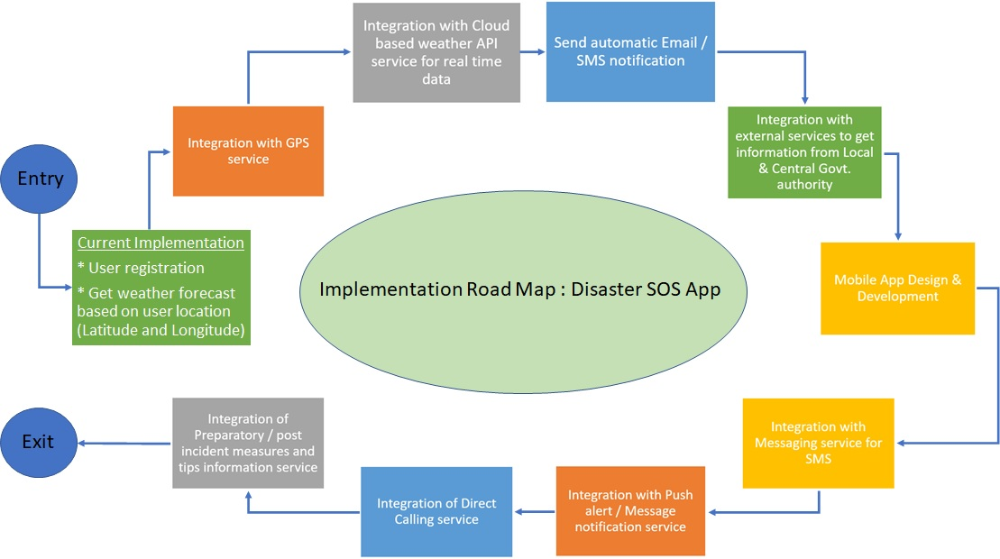

# DisasterSOSApp-Hackathon

A basic GitHub repository example for WIP Hackathon.

_Read this in other languages: [English](README.md), [한국어](./docs/README.ko.md), [português](./docs/README.pt_br.md)._

## Contents

- [Submission or project name](#submission-or-project-name)
  - [Contents](#contents)
  - [Short description](#short-description)
    - [What's the problem?](#whats-the-problem)
    - [How can technology help?](#how-can-technology-help)
    - [The idea](#the-idea)
  - [Demo video](#demo-video)
  - [The architecture](#the-architecture)
  - [Long description](#long-description)
  - [Project roadmap](#project-roadmap)
  - [Getting started](#getting-started)
  - [Live demo](#live-demo)
  - [Built with](#built-with)
  - [Contributing](#contributing)
  - [Versioning](#versioning)
  - [Authors](#authors)
  - [License](#license)
  - [Acknowledgments](#acknowledgments)

## Short description

### What's the problem?

Natural disasters are out of human control, but as the consequences of natural disasters there is human suffering caused by damage to life, personal property, and infrastructure. Every year, millions of people are affected by this, families are displaced, victims lose shelter, face the danger of death or physical injury. This is complicated further by immense shortages of food and drinking water. Several medical and psychological problems among the victims are major offshoots of natural disasters. Though it is beyond human control, but by leveraging new cutting age technology we can minimize the impact to a significant amount and can handle post incident consequences. 
Considering the above facts, the idea of creating an app to assist people to be prepare and take action in case of such emergency, came up by using cloud solution based on their current geographic location and climate.
User will be able to see present weather condition based on their location at any point of time. In case of adverse situation arising due to disaster, can reach out to their extended family members / friends for help. Get information on help / facility and support provided by Govt. authorities in his near vicinity. Will get the alerts sent by Govt. authorities on any critical weather forecast. Application will have provision for general guidelines for Do and Don’ts based on different adverse situations.

### How can technology help?

### The idea

Design and develop a cloud-based application which will be available in both web interface & mobile version for the user. In broader sense, the application will have below capability / functionality made available to the user
User registration and capture relatives / friends list
User Login
Get current weather forecast based on user location (Latitude and Longitude) at any point of time
In case of any situation arises, can directly call (for Mobile App) or send message / email notification to their relatives / friends, listed in profile along with user’s location
In case of any adverse situation (total power outage / no net connectivity), app will send automatic notification to the relatives / friends listed for all target user based on the location of the incident
Provide information on help / facility and support arrangements made by local or central Govt authorities in the vicinity based on geographic location of the user with calling facility (for Mobile App)
Get advance alert notifications for critical weather forecast issued by local or central Govt authorities for public interest
Preparatory / post incident measures and tips / information for different types of disasters

## Demo video

## The architecture

1. The user navigates to the site and uploads a video file.
2. Watson Speech to Text processes the audio and extracts the text.
3. Watson Translation (optionally) can translate the text to the desired language.
4. The app stores the translated text as a document within Object Storage.

## Long description

[More detail is available here](./docs/DESCRIPTION.md)

## Project roadmap

The project currently does the following things.

- Feature 1
- Feature 2
- Feature 3

It's in a free tier IBM Cloud Kubernetes cluster. In the future we plan to run on Red Hat OpenShift, for example.

See below for our proposed schedule on next steps after Call for Code 2021 submission.

## Getting started

In this section you add the instructions to run your project on your local machine for development and testing purposes. You can also add instructions on how to deploy the project in production.

- [sample-react-app](./sample-react-app/)
- [sample-angular-app](./sample-angular-app/)
- [Explore other projects](https://github.com/upkarlidder/ibmhacks)

## Live demo

You can find a running system to test at [callforcode.mybluemix.net](http://callforcode.mybluemix.net/).

## Built with

- [IBM Cloudant](https://cloud.ibm.com/catalog?search=cloudant#search_results) - The NoSQL database used
- [IBM Cloud Functions](https://cloud.ibm.com/catalog?search=cloud%20functions#search_results) - The compute platform for handing logic
- [IBM API Connect](https://cloud.ibm.com/catalog?search=api%20connect#search_results) - The web framework used
- [Dropwizard](http://www.dropwizard.io/1.0.2/docs/) - The web framework used
- [Maven](https://maven.apache.org/) - Dependency management
- [ROME](https://rometools.github.io/rome/) - Used to generate RSS Feeds

## Contributing

Please read [CONTRIBUTING.md](CONTRIBUTING.md) for details on our code of conduct, and the process for submitting pull requests to us.

## Versioning

We use [SemVer](http://semver.org/) for versioning. For the versions available, see the [tags on this repository](https://github.com/your/project/tags).

## Authors

- **Billie Thompson** - _Initial work_ - [PurpleBooth](https://github.com/PurpleBooth)

## License

This project is licensed under the Apache 2 License - see the [LICENSE](LICENSE) file for details.

## Acknowledgments

- Based on [Billie Thompson's README template](https://gist.github.com/PurpleBooth/109311bb0361f32d87a2).
